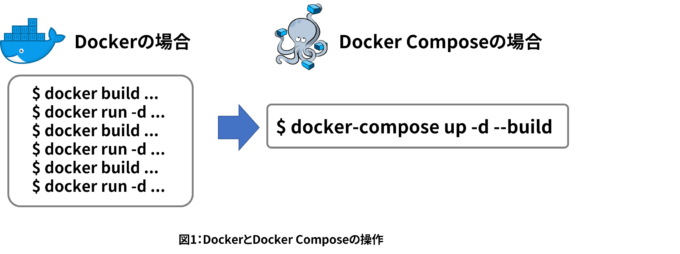
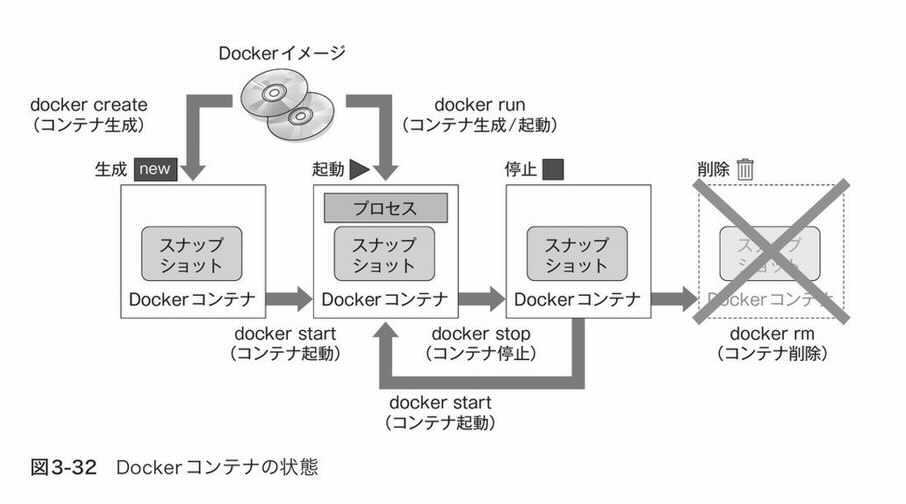

# math-club

### 想定用途
- 数学の視覚的理解に役立てる。

### 参考文献
- [Pythonで学ぶ線形代数学](https://www.amazon.co.jp/dp/B08BP19MMK)

### installation

- 前提：docker Engine, docker-compose をインストールずみ。 ( [docker について↓で補足あり](#docker-%E3%81%A8-docker-compose--%E3%81%AE%E8%A3%9C%E8%B6%B3)) )

- 注意点：Linux には対応できていません。Docker Decktop for Mac, Docker Desktop for Windows を想定しています。  
 (Linux をホストとして使ってる場合、コンテナ上でファイルを読み書きした時に permission denied が発生するはず)  
 **Windows の場合、  WSL 上に Docker を入れるのではなく Docker Desktop for Windows を使うようにすれば本環境が動くはずです(Docker Desktop WSL 2 backend)**  
 (↓で補足します)
- 起動コマンド：
  - `docker-compose up -d` ※
  - 起動できた雰囲気になったら、ブラウザで `http://localhost:8888` へ。Enjoy 👍
  - プロセスを停止する時は `docker-compose stop`
  - ※もし起動できなければ、Docker Engine のデーモンが立ち上がってない可能性が高いです。  
  GUI(Docker Desktop) かコマンドでデーモンの状態を確認し、立ち上がってなければ起動してください。
  コマンドの場合は、`sudo service docker status`, `sudo service docker start`。(Windows Power Shell だと別のコマンドかも。)

- cf: [【Docker】3分でjupyterLab(python)環境を作る！](https://qiita.com/hgaiji/items/edf71435d0565257f980)

---

### docker🐳 と docker compose 🐙 の補足 ～🏃速習Docker🏃～
##### docker と docker-compose を3行で。

- **Q. docker とは?**  
A. ユーザー視点で言えば超軽量な VM みたいなものだという理解でいったんOK。(プロセス単位で仮想化したもの)
- **Q. docker のなにが嬉しいの？**  
A. ソースコードだけでなく開発環境も共有できるところ。また、環境がよごれなくてすむのも嬉しいところの一つ。
- **Q. docker-compose って？**  
A. docker での環境構築をさらに容易にしてくれるもの。docker を使う上で本質的にはなくてもいいやつ。utility だと思ってもよい。    
docker-compose.yml というファイルに設定さえ書いてしまえば、「docker-compose up 叩いといてー」で環境構築が終わるのが cool 。  
特に(1ホスト上で)複数コンテナを立ち上げる時に便利。  
(余談：複数ホストでまたがってコンテナを管理したくなった時に使うのがコンテナオーケストレーションツール。kubernetes がデファクトスタンダード。k8s と略す。)

  

  ( [Docker Compose入門 (2) ～ウェブサーバの開発環境を作るための準備～](https://knowledge.sakura.ad.jp/23632/) より引用。  
  コンテナを複数扱うとなると docker-compose なしにやってられない。)

- **インストール方法** はこちら：
  (Docker Desktop に Docker Engine と Docker compose が入ってる)
  - Mac
    - Docker Desktop for Mac をインストールするのが無難。
    - https://matsuand.github.io/docs.docker.jp.onthefly/docker-for-mac/install/
  - Windows
    - WSL2 を インストールした上で Docker Desktop for Windows をインストールするのが無難。
    - https://matsuand.github.io/docs.docker.jp.onthefly/docker-for-windows/install/
    - 参考(古くなったらごめんなさい)：
      - https://qiita.com/zaki-lknr/items/db99909ba1eb27803456
      - https://qiita.com/fkooo/items/d2fddef9091b906675ca
      - https://tech-lab.sios.jp/archives/21675

##### これだけはおぼえておきたい docker コマンド
(docker に限った話ではないですが)  
コマンドをいくつか叩いてみると docker を理解した気分になれると思います。

docker の流れは ↑ こんな感じ。(『プログラマのためのDocker教科書』より引用)  
以下補足。

- **Docker イメージ** というのがあり、これが言ってみれば "環境(Dockerコンテナ)のもと" となるもの。  
[DockerHub](https://hub.docker.com/) というところに様々な Dockerイメージがあげられている。  
( git管理されたファイルをおいておくのが GitHub, Dockerイメージをおいておくのが DockerHub。)
- 図にあるように、`docker create Dockerイメージ名` というコマンドで Docker イメージから **Dockerコンテナ** を作れる。  
(このコマンドをたたいた時にローカルに Dockerイメージがなければ DockerHub からダウンロードしてくれる。)
- コンテナの一覧は `docker ps -a` で確認できる。コンテナのステータス確認もこのコマンドでやる。  
(`-a` オプションですべてのコンテナを表示。つけなｋれば稼働中のコンテナのみ表示)  
(コンテナのステータスは、`restarting`, `running`, `paused`, `exited` のいずれか。)

- `docker start コンテナid` でコンテナを起動することができる。コンテナid は `docker ps -a` で確認。
- 図にあるように、`docker create Dockerイメージ名` + `docker start コンテナid` を毎回やるのは面倒なのでショートカットが用意されており、それが `docker run Dockerイメージ名` 。  
例えば、`docker run ubuntu:latest /bin/echo 'Hello world'` などとコマンドをたたくと、
「Ubuntu の latest ヴァージョンの Docker イメージをもとにコンテナを作り、そのコンテナを起動し、起動した コンテナの Ubuntu 上で `echo 'Hello World'` を実行する」ということが行われる。
- -it オプションをつけて、`docker run -it ubuntu:latest` などとやると、対話的に実行できる。
- コンテナを停止する時は、`docker stop コンテナid` でやる。
- `docker rm コンテナid` でコンテナを削除できる。
- `docker images` でローカルにある Dockerイメージの一覧を確認でき、いらないものは `docker rmi イメージ名` で削除できる。
(dockerイメージはファイル容量が数GBのものもしばしばあるので容量が気になるようであれば定期的に掃除するとよい)

参考: [Dockerでよく使うコマンドまとめ](https://morizyun.github.io/docker/about-docker-command.html)

##### Docker のおすすめ入門資料
  - https://knowledge.sakura.ad.jp/13265/ さくらインターネットによる入門資料。コマンドをたたきながら理解できる。
  - https://knowledge.sakura.ad.jp/21387/ 同上。docker compose 編。docker の説明が非常にわかりやすい。  
  " このように、特別な状態のプロセスを「コンテナ」と呼び、このコンテナを実行する元になるファイルや関連情報（メタ情報）を、Dockerイメージと呼びます。そして、このDockerイメージは、Docker Hubなどのイメージ・レジストリ（保管庫の意味）を通して、コマンド１つで簡単に送受信できるようにします。 "
  - 『プログラマのためのDocker教科書』 の3章を読んでまずは操作的に理解し、しくみがしりたかったらさらに 2章を読む。
  - 『イラストでわかるDockerとKubernetes』 (本屋で立ち読みしただけですが、よさそうでした)