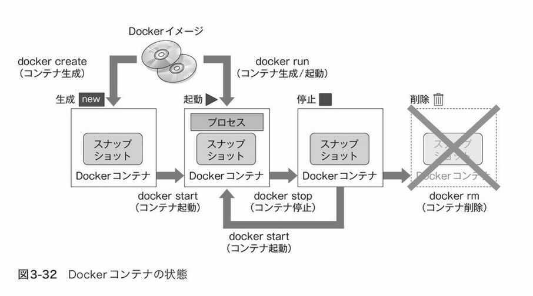

# math-club

### 想定用途
- 数学の視覚的理解に役立てる。

### 参考文献
- [Pythonで学ぶ線形代数学](https://www.amazon.co.jp/dp/B08BP19MMK)

### installation

- 前提：docker, docker-compose をインストールずみ。( [↓で補足あり](#docker-%E3%81%A8-docker-compose--%E3%81%AE%E8%A3%9C%E8%B6%B3)) )

- `docker-compose up -d`

- cf: [【Docker】3分でjupyterLab(python)環境を作る！](https://qiita.com/hgaiji/items/edf71435d0565257f980)

- 起動コマンド：
  - `sudo service docker status` で docker のデーモンが起動してるか確認。起動してなければ `sudo service docker start` で起動する。
  - `docker-compose up -d`
  - 起動できた雰囲気になったら、ブラウザで `http://localhost:8888` へ。Enjoy 👍
  - プロセスを停止する時は `docker-compose stop`

---

### docker🐳 と docker compose 🐙 の補足
##### docker と docker-compose を3行で。

- **Q. docker とは?**  
A. ユーザー視点で言えば超軽量な VM みたいなものだという理解でいったんOK。(プロセス単位で仮想化したもの)
- **Q. docker のなにが嬉しいの？**  
A. ソースコードだけでなく開発環境も共有できるところ。また、環境がよごれなくてすむのも嬉しいところの一つ。
- **Q. docker-compose って？**  
A. docker での環境構築をさらに容易にしてくれるもの。別に使わなくてもよいやつ。  
docker-compose.yml というファイルに設定さえ書いてしまえば、「docker-compose up 叩いといてー」で環境構築が終わるのが cool です.  
特に(1ホスト上で)複数コンテナを立ち上げる時に便利。  
(余談：複数ホストでまたがってコンテナを管理したくなった時に使うのがコンテナオーケストレーションツール。kubernetes がデファクトスタンダード。k8s と略す。)

- **インストール方法** はこちら：
  - Docker: https://docs.docker.com/get-docker/
  - Docker Compose: https://docs.docker.com/compose/install/

##### これだけはおぼえておきたい docker コマンド
(docker に限った話ではないですが)  
コマンドをいくつか叩いてみると docker を理解した気分になれると思います。

docker の流れは ↑ こんな感じ。(『プログラマのためのDocker教科書』より引用)  
以下補足。

- Docker イメージというのがあり、これが言ってみれば "環境(Dockerコンテナ)のもと" となるもの。  
[DockerHub](https://hub.docker.com/) というところに様々な Dockerイメージがあげられている。
( git管理されたファイルをおいておくのが GitHub, Dockerイメージをおいておくのが DockerHub。)
- 図にあるように、`docker create Dockerイメージ名` というコマンドで Docker イメージから Dockerコンテナを作れる。  
(このコマンドをたたいた時にローカルに Dockerイメージがなければ DockerHub からダウンロードしてくれる。)
- コンテナの一覧は `docker ps -a` で確認できる。コンテナのステータス確認もこのコマンドでやる。  
(`-a` オプションですべてのコンテナを表示。つけなｋれば稼働中のコンテナのみ表示)  
(コンテナのステータスは、`restarting`, `running`, `paused`, `exited` のいずれか。)

- `docker start コンテナid` でコンテナを起動することができる。コンテナid は `docker ps -a` で確認。
- 図にあるように、`docker create Dockerイメージ名` + `docker start コンテナid` を毎回やるのは面倒なのでショートカットが用意されており、それが `docker run Dockerイメージ名` 。  
例えば、`docker run ubuntu:latest /bin/echo 'Hello world'` などとコマンドをたたくと、
「Ubuntu の latest ヴァージョンの Docker イメージをもとにコンテナを作り、そのコンテナを起動し、起動した コンテナの Ubuntu 上で `echo 'Hello World'` を実行する」ということが行われる。
- -it オプションをつけて、`docker run -it ubuntu:latest` などとやると、対話的に実行できる。
- コンテナを停止する時は、`docker stop コンテナid` でやる。
- `docker rm コンテナid` でコンテナを削除できる。
- `docker images` でローカルにある Dockerイメージの一覧を確認でき、いらないものは `docker rmi イメージ名` で削除できる。

参考: [Dockerでよく使うコマンドまとめ
](https://morizyun.github.io/docker/about-docker-command.html)

##### Docker のおすすめ入門資料
  - https://knowledge.sakura.ad.jp/13265/ コマンドをたたきながら理解できる。
  - 『プログラマのためのDocker教科書』 の3章を読んで docker を操作的に理解し、しくみがしりたかったらさらに 2章を読む。